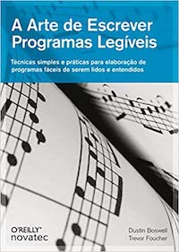

Publicado no Brasil em 2012 pela Novatec, o livro **A Arte de Escrever Programas Legíveis** (título original: *The Art of Readable Code*) dos autores Dustin Boswell e Trevor Foucher, cumpre o proposto em seu subtítulo ao apresentar *técnicas simples e práticas para elaboração de programas fáceis de serem lidos e entendidos*.

Suas 210 páginas estão divididas em quarto partes: "Melhorias superficiais", "Simplificação de *loops* e lógica", "Reorganização de seu código" e encerra com "Tópicos selecionados". Cada uma das partes aborda pontos importantes que buscam garantir a manutenção e legibilidade do código.

De início os autores apresentam duas ideias-chave que nortearão toda a obra:

- Códigos devem ser fáceis de entender
- Códigos devem ser escritos de modo a minimizar o tempo necessário para sua compreensão

Uma vez que a maior parte do tempo gasto por um desenvolvedor está em ler códigos, e não escrever, garantir a compreensão e legibilidade significa, entre outros, garantir o ganho de eficiência e produtividade no desenvolvimento. É uma obra que, certamente, vale seu preço tendo em vista o retorno que traz.


**O que torna um código melhor?**

Essa é a primeira pergunta respondida pelos autores. Ao analisar vários dos códigos que produziram ao longo de suas carreiras, além de códigos de outras pessoas, definiram o chamado **Teorema Fundamental da Legibilidade**. De acordo com o teorema, caso você pedisse para alguém ler seu código a ponto de poder fazer manutenções, *debugs*, etc. quanto tempo essa pessoa levaria? Essa é a métrica a ser otimizada.

Um dos primeiros mitos que os autores desfazem é a ideia de "menos é mais", isto é, muitas vezes um código de 2000 linhas é mais ilegível do que um de 5000, apesar de fazerem exatamente a mesma coisa. Para isso, logo de cara, apresentam como uma simples melhoria pode tornar o código melhor:

**Código Original**
```php
assert((!(bucket = FindBucket(key))) || !bucket->IsOccupied());
```

**Pequenas Melhorias**
```php
bucket = FindBucket(key);
if (bucket != NULL) assert(!bucket->IsOccupied());
```

É importante lembrar, como pythonista, essas ideias estão no *Zen of Python* - se ainda não conhece abra o Python e então `import this`, apenas para citar algumas:

```python
# ...
"Explicit is better than implicit." # Explícito é melhor do que implícito
"Simple is better than complex." # Simples é melhor do que complexo
"Complex is better than complicated." # Complexo é melhor do que complicado
# ...
"Readability counts." # Legibilidade conta
# ...
```
