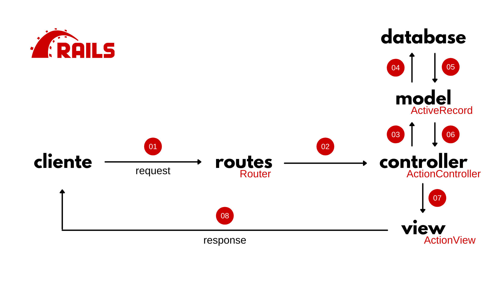

## O que é Rails

Lançado em 2004, o Ruby on Rails (ou apenas Rails) é um meta-framework de padrão MVC (_Model-View-Controller_), de código livre (licença MIT), que encoraja e facilita o desenvolvimento de aplicações web ao utilizar padrões comuns da internet como html, json e xml.

Como um meta-framework (framework de frameworks), ele é estruturado a partir de outros frameworks:

- **Active Record**: camada de mapeamento de objeto relacional (ORM);
- **Active Pack**: compreende o _Action View_, responsável pela renderização das respostas) e o _Action Controller_, responsável pelo controle de fluxo de negócio;
- **Active Mailer**: responsável pelo serviço de entrega e recebimento de e-mails;
- **Active Support**: coleção de classes e extensões úteis ao framework
- **Action WebServices**: provê uma maneira de publicar APIs com o Rails sem a necessidade de grandes configurações e especificações de protocolo

## Filosofia

A filosofia do Rails tem dois princípios fundamentais que norteriam sua estrutura e funcionamento:

- **Convention over Configuration (CoC)**: no desenvolvimento das aplicações, muitas coisas são um padrão recorrente, dessa forma, a filosofia do Rails enfatiza utilizar essa convenção como padrão, poupando tempo do desenvolvedor em ter que configurar cada pequeno elemento;
- **Don't Repeat Yourself (DRY)**: utilizando-se fortemente de herança e orientação a objetos, o Rails destaca a importância de códigos limpos, concisos e sem repetições. Dessa forma, o framework incentiva que se algo será utilizado mais de uma vez ou em mais de um lugar, que seja feito um isolamento desse trecho de código para que o mesmo seja reaproveitado.

## Visão Geral



A imagem acima, não pretende ser detalhista ou precisa sobre os detalhes do Rails, mas sim, mostrar a visão geral da arquitetura do framework e como cada elemento se relaciona.

- **01**: O Cliente acessa o URL do site através do seu navegador;
- **02**: Essa requisição chega ao servidor que passa a URL para `routes`. Nele, será identificado se há algum `controller` que lide com essa URL;
- **03**: Identificado o `controller`, o mesmo chamará o `model` correspondente em busca das informações necessárias para completar a sua resposta;
- **04**: O `model` fará a consulta ao Banco de Dados;
- **05**: O Banco de Dados retorna a resposta para o `model` que  a estrutura, conforme suas definições;
- **06**: O `model` retorna os dados, de forma estruturada, para o `controller`
- **07**: O `controller` faz as montagens e validações necessárias e chama a `view` correspondente, passando para ela as variáveis e respostas obtidas do `model`;
- **08**: A `view` renderiza o template criado com os dados passados pelo `controller` e responde a requisição do usuário.

## Iniciando um Projeto

Ao instalar o Rails, você estará instalando junto o [Rails CLI](https://guides.rubyonrails.org/command_line.html). A interface de linha de comando do Rails permite que sua aplicação seja criada rápida e facilmente a partir de um comando no Terminal:

```bash
rails new <project_name> <args>
```

Além disso, é possível passar alguns argumento na criação do projeto, destacando itens como:

- `--skip-gemfile`: não cria o arquivo `Gemfile`
- `--skip-git`: não cria o arquivo `.gitignore`
- `--skip-test`: não instala o framework padrão de testes ([Minitest](https://guides.rubyonrails.org/testing.html))
- `--skip-active-storage`: não cria os arquivos do `Active Storage`, responsável pelo armazenamento de arquivos
- `--skip-action-mailer`: não cria os arquivos do `Active Mailer`, responsável pelo gerenciamento de emails

## Entendendo as Pastas

Ao criar um projeto Rails, o CLI fará a estruturação de diversos arquivos, de acordo com a arquitetura do framework, com destaque para os seguintes arquivos e diretórios:

```bash
root
│
├─ README.md
├─ Gemfile
│
├─ app/
│  ├─ controllers/
│  ├─ models/
│  └─ views/
│
├─ config/
│  └─ routes.rb
│
├─ db/
│  ├─ migrate/
│  ├─ schema.rb
│  └─ seeds.rb
│
└─ log/
   ├─ development.log
   └─ test.log
```

Abaixo uma breve descrição de cada arquivo/diretório:

- `README.md`: arquivo de leitura onde as instruções gerais do projeto devem ser preenchidas
- `Gemfile`: arquivo onde as dependências (gems) do projeto serão identificadas para instalação e execução
- `app/controllers/`: diretório onde os controllers do projeto deverão ser criados
- `app/models/`: diretório onde os do models projeto deverão ser criados
- `app/views/`: diretório onde as views do projeto deverão ser criados
- `config/routes.rb`: arquivo onde as rotas do projeto deverão ser identificadas
- `db/migrate/`: diretório onde as migrações do banco de dados serão criadas
- `db/schema.rb`: arquivo-base do Banco de Dados, onde as definições e estrutura de todas as tabelas do banco serão configuradas
- `db/seeds.rb`: arquivo de _fixture_ com dados iniciais a serem carregados no Banco de Dados
- `log/development.log`: arquivo com os logs de execução do ambiente de desenvolvimento
- `log/test.log`: arquivo com os logs de execução do ambiente de teste

---

## Olá Mundo

### Rodando o Projeto

Para testar o seu projeto Rails, se está funcionando e se está corretamente configurado, podemos rodá-lo usando o comando:

```bash
rails server
```

Abra o navegador em `localhost:3000` e você deverá ver a mensagem de boas-vindas do Rails.

### Criando Rotas

Todo o fluxo de MVC começa com uma requisição do cliente. Vamos criar um rota que defina a nossa página principal (_home page_). Para isso, abra o arquivo `config/routes.rb`. E digite:

```ruby
Rails.application.routes.draw do
    get '/', to: 'home#index'
end
```

Aqui há algumas definições importantes:

- Definimos que essa rota será acessada através do verbo `get`
- Indicamos que ela deverá acessar o controller `home`
- Indicamos que o controller deverá invocar o método `index`

Aqui poderíamos variar em qualquer verbo HTTP, qualquer nome de controller e qualquer método dentro do controller. Deste que essa estrutura fosse respeitada.

Porém, no caso da _home page_, como elemento raiz de qualquer site, há uma conveção do Rails, de utilizar:

```ruby
Rails.application.routes.draw do
    # É equivalente a: get '/', to: 'home#index'
    root 'home#index'
end
```

### Criando o Controller

Uma vez criada a rota e indicado que a mesma deverá chamar o controller `home`, para isso, crie o arquivo `app/controllers/home_controller.rb`. Esse arquivo será o responsável por controlar as requisições e respostas da _home page_.

Dentro deste arquivo, digite:

```ruby
# Define o nome da classe, neste caso, Home
# e Herda de ApplicationController
class HomeController < ApplicationController
    # Método invocado pela rota default do controller
    # Implicitamente retorna um render do template (view) de index.html.erb
    def index
    end
end
```

> Na imagem da Visão Geral do Rails, é possível observar que o controller é estruturado em `ActionController`. Ele é o responsável por implementar a interface e as principais funcionalidade dos controllers. No caso, o `ApplicationController`, herda seus comportamentos dele.

### Criando a View

Um controller, tem duas ações principais: requisitar dados do Banco de Dados e renderizar a Resposta. No caso da _home page_, não há, no momento nenhuma consulta ao Banco de Dados, mas podemos renderizar a nossa view.

Para a linguagem Ruby, toda função deve, obrigatoriamente ter um `return`, dessa forma, o uso da palavra não é necessária, de forma que o último elemento da função obrigatoriamente será retornada.

O Rails, utilizando-se desse princípio, tem como comportamento padrão retornar uma view a partir de um template com a estrutura `controller/method`, de forma que o método `index` devolverá o arquivo `home/index.html.erb`.

Apenas para mérito de exemplo, o que o Rails faz por padrão é renderizar da seguinte maneira:

```ruby
class HomeController < ApplicationController
    def index
        return render template 'home/index' # Não faça isso!
    end
end
```

> O código acima é apenas para explicitar o comportamento do Rails, não faça assim!

Uma vez explicado esse comportamento do controller, precisamos criar nosso arquivo de view, para isso crie o arquivo `app/views/home/index.html.erb` e preencha com:

```html
<h1>Olá mundo</h1>
```

Note que criamso um arquivo `HTML`, com uma extensão adicional `.erb`. Essa extesão adicional é o _Embedded Ruby_, isto é um código Ruby incorporado em um código HTML. Para provar que isso é verdade, altere o código acima para:

```html
<h1>Olá mundo</h1>
<p>2 + 2 é igual a <%= 2 + 2 %></p>
<p>2 + 3 é igual a <% 2 + 3 %></p>
<%# observe a diferença entre os códigos Ruby %>
```

Note que o código Ruby é passado através de um conjunto especial de tags (`<% %>`), sendo que há três formatos:

- `<% %>`: executa um código Ruby/Rails, sem exibir na tela
- `<%= %>`: executa e exibe o código Ruby/Rails na tela
- `<%# %>`: cria um comentário de código Ruby/Rails

Ao executar o servidor, será possível ver o comportamento-base de uma aplicação Rails. =)

## Referências

- [Documentação Oficial](https://guides.rubyonrails.org/index.html)