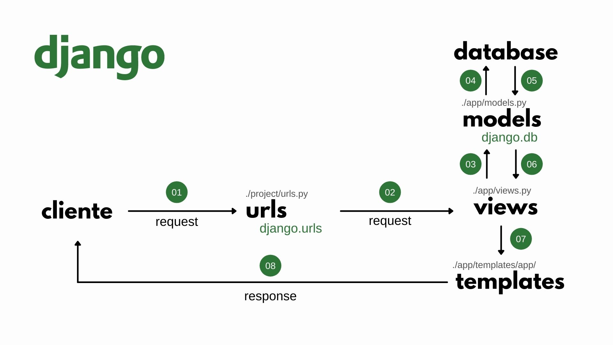

## O que é Django


Lançado em 2005, o Django é um framework de padrão MVT (_Model-View-Template_), escrito em Python e de licença BSD, que enfatiza o rápido desenvolvimento, usando-se ao máximo do princípio DRY (_Don't Repeat Yourself_).

O Django tem como principais características:

- **Mapeamento Objeto-Relacional (ORM)**: permite o gerenciamento e comunicação com o Banco de Dados através da linguagem Python
- **Interface Administrativa**: é possível gerar a interface administrativa automaticamente através do ORM
- **Formulários**: é possível gerar formulário automaticamente através dos modelos de dados
- **URLs Amigáveis**: permite e encoraja a criação de URLs amigáveis e personalizadas
- **Sistema de Templates**: possui linguagem de templates simples, poderosa e amigável
- **Sistema de Cache**: possui um sistema de cache
- **Internacionalização**: total suporte para a internacionalização (I18n), permitindo a criação de sistemas em vários idiomas

## Visão Geral



A imagem acima, não pretende ser detalhista ou precisa sobre os detalhes do Django, mas sim, mostrar a visão geral da arquitetura do framework e como cada elemento se relaciona.

- **01**: O Cliente acessa o URL do site através do seu navegador;
- **02**: Essa requisição chega ao servidor que passa a URL para `urls.py`. Nele, será identificado se há alguma `view` que lide com essa URL;
- **03**: Identificada a `view`, o mesmo chamará o `model` correspondente em busca das informações necessárias para completar a sua resposta;
- **04**: O `model` fará a consulta ao Banco de Dados;
- **05**: O Banco de Dados retorna a resposta para o `model` que  a estrutura, conforme suas definições;
- **06**: O `model` retorna os dados, de forma estruturada, para a `view`
- **07**: A `view` faz as montagens e validações necessárias e chama o `template` correspondente, passando para ela as variáveis e respostas obtidas do `model`;
- **08**: O `template` é renderizado com os dados passados pela `view` e responde a requisição do usuário.

## Iniciando um Projeto

Ao instalar o Django, você terá disponível o [django-admin](https://docs.djangoproject.com/en/3.1/ref/django-admin/). Com ele, é possível executar comandos no terminal passando os parâmetros necessários. Para criar um projeto, por exemplo, basta digitar:

```bash
django-admin startproject <project_name> <directory>
```

## Entendendo as Pastas

Ao criar um projeto Django, o django-admin fará a estruturação de diversos arquivos, de acordo com a arquitetura do framework, com destaque para os seguintes arquivos e diretórios:

```bash
root
│
├─ manage.py
│
└─ myproject/
   ├─ __init__.py
   ├─ asgi.py
   ├─ settings.py
   ├─ urls.py
   └─ wsgi.py
```

Abaixo uma breve descrição de cada arquivo/diretório:

- `manage.py`: utilitário de linha de comando do django para a execução de tarefas administrativas
- `myproject/__init__.py`: arquivo para definição de modulo (padrão Python)
- `myproject/asgi.py`: interface entre o servidor web e a aplicação (assíncrona)
- `myproject/settings.py`: arquivo de configurações do projeto
- `myproject/urls.py`: arquivo de definição das urls do projeto
- `myproject/wsgi.py`: interface entre o servidor web e a aplicação

---

## Olá Mundo

### Rodando o Projeto

Para testar o seu projeto Django, se está funcionando e se está corretamente configurado, podemos rodá-lo usando o comando:

```bash
manage.py runserver
```

Abra o navegador em `localhost:8000` e você deverá ver a mensagem de boas-vindas do Django.

### Criando um App

Vamos começar criando um app que responderá pela _home page_, para isso, basta executarmos o seguinte comando no Terminal passando `home` como nome do app:

```bash
django-admin startapp <my_app>
```

Com isso o Django criará os seguintes arquivos:

```bash
root
│
├─ manage.py
├─ myproject.py
│
└─ home/
   ├─ __init__.py
   ├─ admin.py
   ├─ apps.py
   ├─ migrations/
   ├─ models.py
   ├─ tests.py
   └─ views.py
```

Sendo a função de cada um dos respectivos arquivos/diretórios:

- `__init__.py`: define o diretório como um módulo Python
- `admin.py`: responsável pela criação desse app na área administrativa
- `apps.py`: responsável pelas configurações do app
- `migrations/`: responsável por gerenciar as modificações do model no Banco de Dados
- `models.py`: responsável pela criação dos modelos e sua vinculação com o Banco de Dados
- `tests.py`: responsável pela criação de testes
- `views.py`: responsável pela recebimento e resposta das requisições (controller)

Uma vez criada a aplicação, o próximo passo é adicioná-la a lista de aplicações do Django. Para isso, abra o arquivo `myproject/settings.py` e adicione o nome do app:

```python
# myproject/settings.py
INSTALLED_APPS = [
    # ...
    'django.contrib.staticfiles',
    'home',
]
```

### Adiiconando uma View

Abra no diretório do app o arquivo `myproject/home/views.py` e crie a seguinte função:

```python
from django.shortcuts import render

def index(request):
    return render(request, 'home/index.html')
```

O arquivo começa com a importação de uma função do Django (`render`) que é responsável pela renderização dos templates. Em seguida, cria-se uma função que recebe a requisição do usuário e faz responde a requisição se utilizando de um template especificado.

### Criando o Template

Para criar um template, basta criar o diretório: `home/templates/home` e dentro dele criar o arquivo `index.html` com o seguinte conteúdo:

```html
<h1>Olá mundo</h1>
```

> Observe que o padrão `<app>/templates/<app>` é adotado pelo Django uma vez que ele buscará pelo template em todas as pastas `templates` do projeto

Além do conteúdo HTML o Django incorpora a linguagem de template do [Jinja](https://jinja.palletsprojects.com/en/2.11.x/) permitindo expressões e variáveis sejam executadas de forma semelhante ao adotado pelo Python e pelo Django:

```html
<h1>Olá mundo</h1>
{# Comentário do Código #}

    {{ total }}


```
Note que o código Jinja é passado através de um conjunto chaves (`{ }`), sendo que há três formatos:

- ``: cria blocos de execução de código, mas não os exibe na tela
- `{{ }}`: exibe as variáveis e valores na tela
- `{# #}`: cria comentário no código HTML

Ao executar o servidor, será possível ver o comportamento-base de uma aplicação Django. =)

## Referências

- [Documentação Oficial](https://docs.djangoproject.com/en/3.2/)