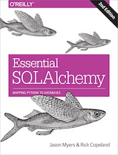

### Usando Joins

Podemos utilizar dois métodos, o `join()` e o `outerjoin()` para consultar dados relacionados. Para isso, o SQL Alchemy fornece o método `select_from()` o qual permite que uma série de joins seja realizadas

```python
columns = [
    orders.c.order_id,
    users.c.username,
    users.c.phone,
    cookies.c.cookie_name,
    line_items.c.quantity,
    line_items.c.extended_cost
]

cookiemon_orders = select(columns)
cookiemon_orders = cookiemon_orders.select_from(
    orders.join(users).join(line_items).join(cookies)
).where(users.c.username == 'cookiemon')

result = connection.execute(cookiemon_orders).fetchall()
for row in result:
    print(row)
```

O comando executado pelo SQL Alchemy é semelhante ao seguinte comando SQL:

```sql
SELECT
    orders.order_id, users.username,
    users.phone, cookies.cookie_name,
    line_items.quantity, line_items.extended_cost
FROM users
JOIN orders ON users.user_id = orders.user_id
JOIN line_items ON orders.order_id = line_items.order_id
JOIN cookies ON cookies.cookie_id = line_items.cookie_id
WHERE users.username = :username_1
```

Para fazer o *outerjoin*, basta utilizar o método `outerjoin()`, passando a tabela em que a consulta deverá ser realizada:

```python
from sqlalchemy import func
columns = [
    users.c.username,
    func.count(orders.c.order_id)
]

all_orders = select(columns)
all_orders = all_orders.select_from(users.outerjoin(orders))
all_orders = all_orders.group_by(users.c.username)
result = connection.execute(all_orders).fetchall()
for row in result:
    print(row)
```

### Usando Alias

Ao usar *joins*, frequentemente é necessário fazer referência a uma tabela mais de uma vez. No SQL, é possível fazer isso através do `alias` em uma consulta.

Veja um exemplo:

```python
employee_table = Table(
    'employee', metadata,
    Column('id', Integer, primary_key=True),
    Column('manager', None, ForeignKey('employee.id')),
    Column('name', String(255)))
```

Neste caso, temos uma tabela de empregado em que o gestor (*manager*), é também um empregado. Para consultar os funcionários que são gerenciados por "Fred", por exemplo, o comando SQL necessário seria:

```sql
SELECT employee.name
FROM employee, employee AS manager
WHERE employee.manager_id = manager.id
AND manager.name = 'Fred'
```

Com o SQL Alchemy, também é possível criar alias, basta fazer o seguinte:

```python
manager = employee_table.alias('mgr')
stmt = select(
    [employee_table.c.name],
    and_(
        employee_table.c.manager_id == manager.c.id,
        manager.c.name == 'Fred'
    )
)
```

Para garantir que não haja conflito com um nome já existente no Banco, o SQL Alchemy cria automaticamente o alias, caso nenhum seja pré-definido:

```python
manager = employee_table.alias()
stmt = select(
    [employee_table.c.name],
    and_(
        employee_table.c.manager_id == manager.c.id,
        manager.c.name == 'Fred'
    )
)
```

Isso resultaria no seguinte comando SQL:

```sql
SELECT employee.name
FROM employee, employee AS employee_1
WHERE employee.manager_id = employee_1.id AND employee_1.name = "Fred"
```

### Agrupamentos

Quando se faz necessário agrupar uma ou mais colunas, por exemplo, na hora de fazer agregações como `count`, `sum`, etc, pode ser necessário agrupar os valores retornados sob uma determinada coluna. Para isso use o método `group_by()`, passando como parâmetro a coluna que fará a agregação

```python
columns = [
    users.c.username,
    func.count(orders.c.order_id)
]

all_orders = select(columns)
all_orders = all_orders.select_from(users.outerjoin(orders))
allx_orders = all_orders.group_by(users.c.username)
result = connection.execute(all_orders).fetchall()
for row in result:
    print(row)
```

No exemplo acima, o agrupamento permite que se obtenha quantos pedidos foram feitos por cada usuário.

### Consultas Cruas (Raw)

É possível que, eventualmente, seja necessário utilizar algum comando SQL puro. Para isso, basta passar o comando SQL como um string para o método `execute()`:

```python
result = connection.execute("select * from orders").fetchall()
print(result)
```

Para facilitar o uso de SQL puro, o SQL Alchemy contém a função `text()` que permite a passagem de uma parte da consulta necessária, garantindo a facilidade do restante.

```python
from sqlalchemy import text
stmt = select([users]).where(text('username=cookiemon'))
```
